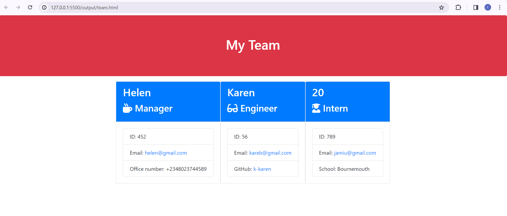

# teamProfileGenerator

## Description
The repository consists of resources and codes that allow users to generate a webpage that displays their team members basic information so that they can have quick access to their emails and GitHub profiles.

## Installation 
-Jest library
-Inquiry #library
-Bootstrap
-Fontawesome.

## Usage
This application takes in information about employees on a team, then generate an HTML webpage that displays summaries for each person using node js command prompt line application with inquirer. It is useful for compiling profiles of employees in a firm.

## Credit
 The credits goes to https://react-bootstrap.netlify.app/docs/getting-started/introduction in understanding the purpose of documentation, https://www.npmjs.com/package/inquirer,https://www.https://www.reddit.com/,w3schools.com/nodejs/.The idea of the project from bootcamp team.
 ## Image  (screen-shot);

 ## project Url deployment
  https://rodiat-oluwaseun.github.io/teamProfileGenerator/

 ## License 
 N/A.